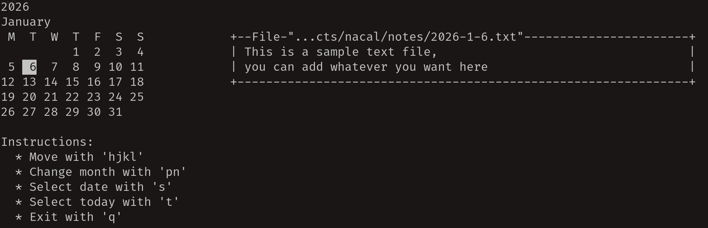
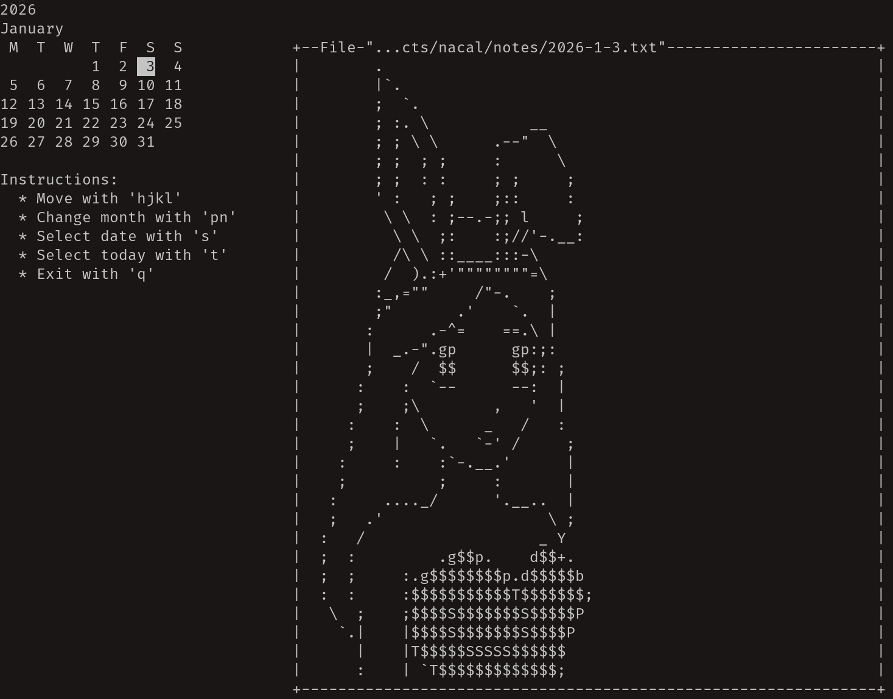

# nacal
'nacal' is a lightweight TUI (Text User Interface) calendar written in C and ncurses.
It allows you to navigate through a calendar and view notes for individual days, all from the terminal.

The interface is keyboard-driven.





## Features
- Terminal-based calendar (TUI)
- Navigate days and months
- View persistent notes for each day
- Lightweight and fast

## Requirements
- C compiler (GCC or compatible)
- ncurses

## Creating notes
To create notes, create a folder and create files of the form YYYY-MM-DD.txt. If the day or month has only one digit, do NOT add the zero:

```
2024-1-24.txt
```

If you want to add recurring notes, create the following files

```
recurring.txt
```

To specify when to apply the recurring notes, use $ plus the last three digits of crontab format. An example here:


```
This text always appears
$ 1 1 *
Only on the first of January
$ * * 0
This only
on
Saturdays
```

## Compilation

```
make
```

```
./nacal <pathToFolderWithNotes>
```

## Basic controls
- 'hjkl' keys to navigate though the same month
- 'np' keys to change months
- 's' key to select specific date
- 't' key to select today
- 'q' key to quit

## License

This project is provided as-is for learning and personal use.

